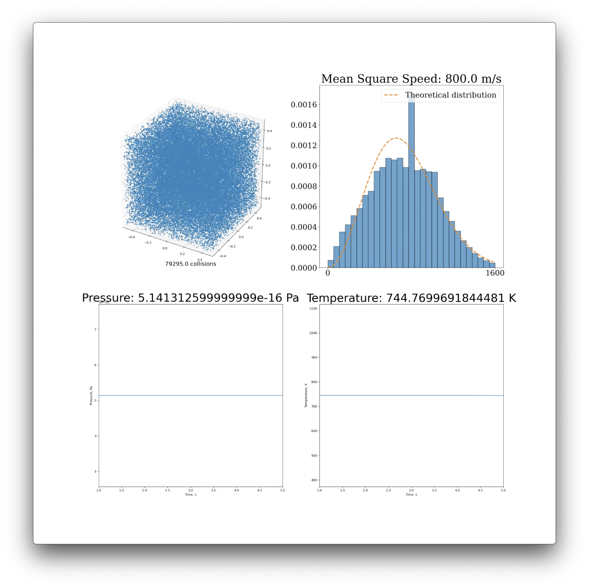
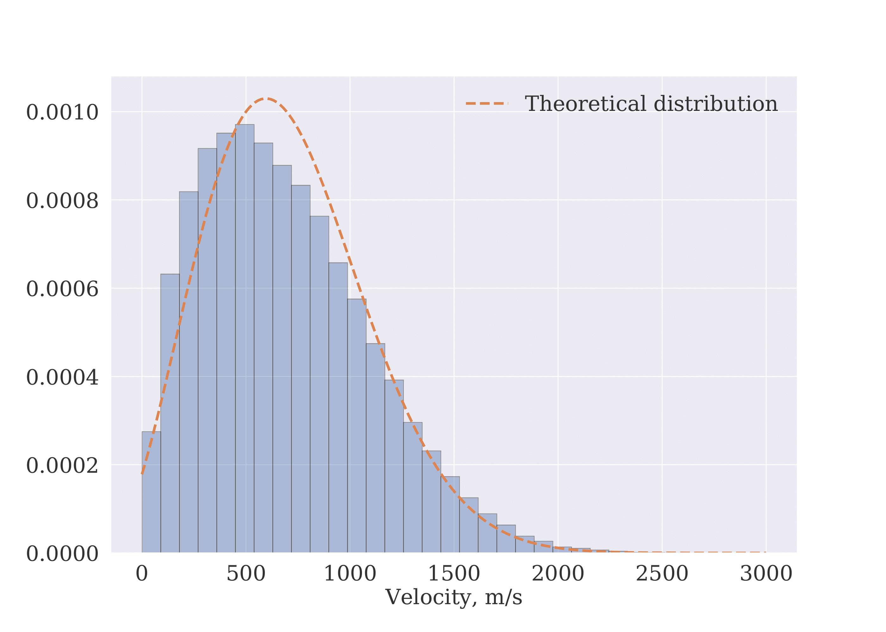

# SimulationGasModel

Here you can find a link to the code used in the project: [Link](code)

Here you can find the final text of the article: [final paper](report/eng_finall.pdf)

[Link](code) | [final paper](report/eng_finall.pdf)

  |  
